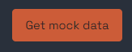
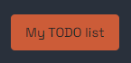
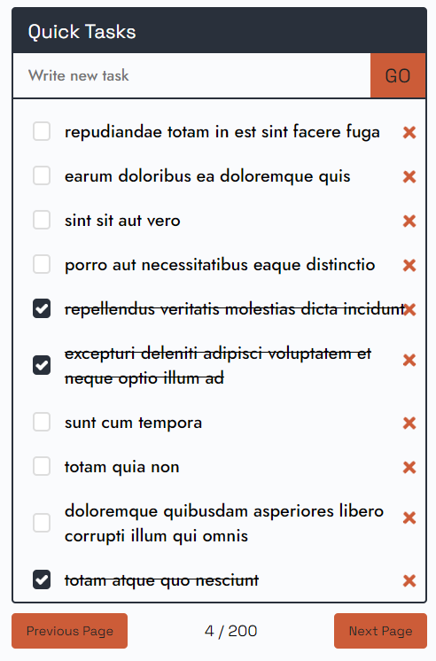
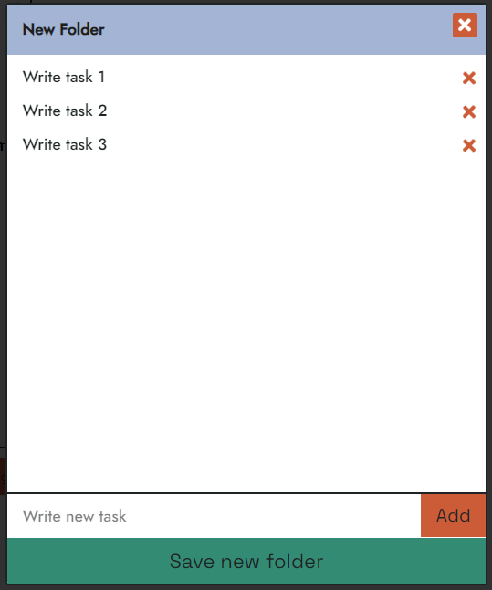

# React WellWork Todo-list Web App

## Overview

This is a feature-rich React Todo-list web app that allows users to manage their tasks efficiently. Users can create folders to organize tasks, and the app supports local storage for data persistence. Additionally, mock data can be fetched from JSONPlaceholder for testing purposes.

## Features

- **Task Management:**

  - Add new tasks
  - Mark tasks as completed
  - Edit existing tasks
  - Delete tasks
  - Create Theme-folders

- **Folder Management:**

  - Create new folders
  - Organize tasks within folders

- **Data Persistence:**

  - Utilizes local storage to save user data

- **Mock Data:**
  - Fetches mock data from [JSONPlaceholder](https://jsonplaceholder.typicode.com/todos) for testing

## Technologies Used

- React
- JavaScript
- SCSS

## Getting Started

### Prerequisites

- Node.js and npm installed on your machine.

### Installation

1. Clone the repository:

`$: git clone https://github.com/Salymka/ww-todo-list.git`

2. Navigate to the project directory:

`$: cd ww-todo-list`

3. Install dependencies:

`$: npm install`

4. Run the development server:

`$: npm run start`

- Visit http://localhost:3000 in your web browser to access the Todo-list app.

## How to Use

1. **Open the app in your web browser.**

2. **Add new tasks using the input field and GO button.**

3. **Mark tasks as completed by clicking on them.**

4. **Delete tasks using the delete button.**

5. **Create new folders to organize tasks.**

6. **Data is saved locally, providing persistence across sessions.**

## Test Data

- For testing purposes, the app fetches mock data from [JSONPlaceholder](https://jsonplaceholder.typicode.com/). You can disable this feature for production use.

## Website Header

The website header features three buttons:

1. **Get Mock Data**  - Allows you to retrieve mock data and display it in the quick tasks block.

2. **Create New Folder**  - Opens a window for creating a themed folder.

3. **My TODO List**  - Navigates from the global page to the task lists.

## Quick Tasks

In the Quick Tasks block, you can perform the following actions:

- Add new tasks.
- Delete tasks.
- Mark tasks as completed.

Additionally, there is a pagination feature to navigate through a large number of old tasks.

## Themed Folders Panel and Editing Window

The Themed Folders panel displays folders sorted by the date of creation, with the freshest ones at the top. Each folder has the following functionalities:

- **Delete:** Remove the folder.
- **Update Content:** Edit the content of the folder.

When creating a themed folder, it is assigned a distinct color for easier visual identification.

{style: "margin: 0 auto"}

